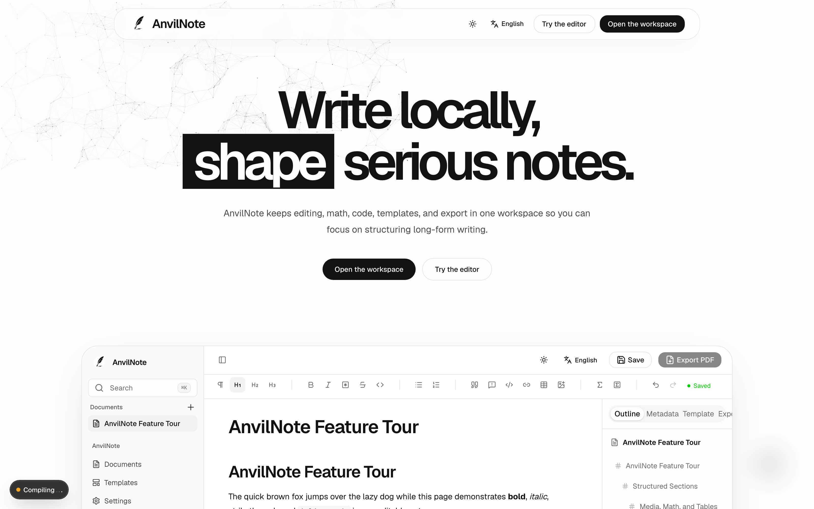

# Features

## Writing

- Block-based editing with headings, lists, tables, and images
- Math formulas
- Code blocks with syntax highlighting
- Document outline for navigating long documents

## Templates

Start from a template for reports, lecture notes, or academic articles instead of a blank page. Templates are rendered through the same Typst pipeline used for export, so the preview matches the final PDF.

## Export

- **PDF export**, built on [Typst](https://typst.app/) for fast, high-quality output
- **DOCX export**, for sharing with tools that expect Word documents

## Offline-first

- No login required for local desktop use
- No dependency on external cloud services for local desktop use
- The desktop app bundles the tooling it needs — no separate Node.js or Typst install required

## Supported interface languages

| Language | Locale |
| --- | --- |
| English | `en` |
| Traditional Chinese | `zh-TW` |
| Japanese | `ja` |
| Korean | `ko` |
| Thai | `th` |
| Russian | `ru` |

## What's not here yet

AnvilNote is in early development. See the [roadmap](https://github.com/AnvilNote/anvilnote/blob/main/ROADMAP.md) for what's planned and what's explicitly not planned (for example, a mandatory cloud account).
