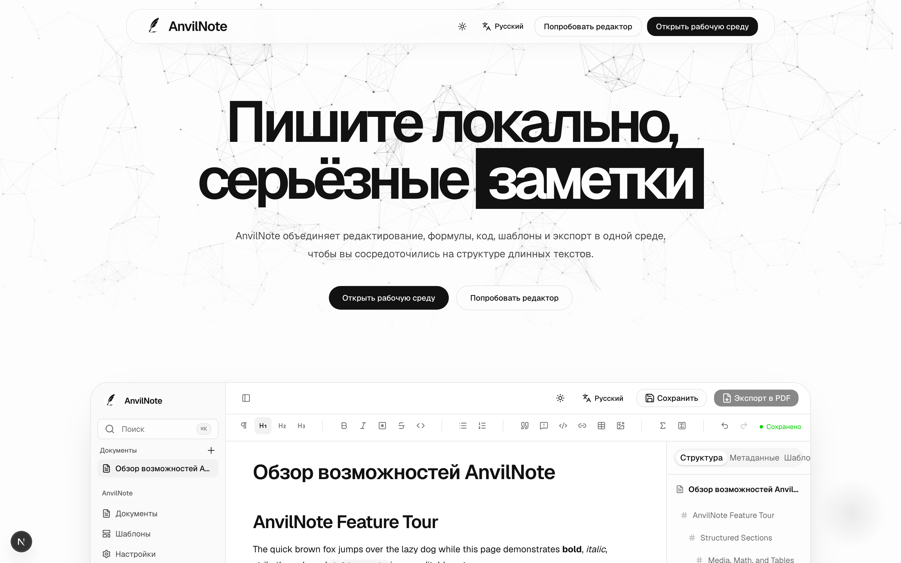

# Возможности

## Письмо

- Блочное редактирование: заголовки, списки, таблицы, изображения
- Формулы
- Блоки кода с подсветкой синтаксиса
- Структура документа для навигации по длинным документам

## Шаблоны

Начните с шаблона для отчёта, конспекта лекции или академической статьи вместо чистого листа. Шаблоны рендерятся через тот же конвейер Typst, что и экспорт, поэтому предпросмотр совпадает с итоговым PDF.

## Экспорт

- **Экспорт в PDF** на основе [Typst](https://typst.app/) — быстро и качественно
- **Экспорт в DOCX** — для обмена с теми, кому нужен файл Word

## Офлайн-режим по умолчанию

- Не требует входа в систему для локального использования на десктопе
- Локальное использование на десктопе не зависит от внешних облачных сервисов
- Десктопное приложение включает все необходимые инструменты — Node.js и Typst устанавливать отдельно не нужно

## Поддерживаемые языки интерфейса

| Язык | Локаль |
| --- | --- |
| Английский | `en` |
| Традиционный китайский | `zh-TW` |
| Японский | `ja` |
| Корейский | `ko` |
| Тайский | `th` |
| Русский | `ru` |

## Чего пока нет

AnvilNote находится на ранней стадии разработки. Что запланировано, а что сознательно не планируется (например, обязательная облачная учётная запись) — см. в [дорожной карте](https://github.com/AnvilNote/anvilnote/blob/main/ROADMAP.md).
