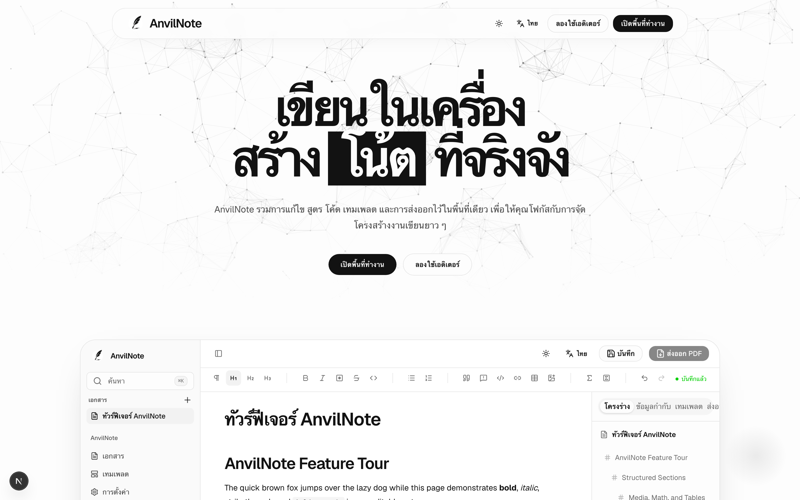

# ฟีเจอร์

## การเขียน

- แก้ไขแบบ block-based รองรับหัวข้อ รายการ ตาราง และรูปภาพ
- สูตรคณิตศาสตร์
- บล็อกโค้ดพร้อม syntax highlighting
- โครงร่างเอกสารสำหรับไล่ดูเอกสารยาว ๆ ได้ง่าย

## เทมเพลต

เริ่มต้นจากเทมเพลตสำหรับรายงาน บันทึกการบรรยาย หรือบทความวิชาการ แทนที่จะเริ่มจากหน้าว่าง เทมเพลตถูกเรนเดอร์ผ่านไปป์ไลน์ Typst เดียวกับตอนส่งออก พรีวิวจึงตรงกับไฟล์ PDF สุดท้าย

## การส่งออก

- **ส่งออกเป็น PDF** ขับเคลื่อนด้วย [Typst](https://typst.app/) รวดเร็วและคุณภาพสูง
- **ส่งออกเป็น DOCX** สำหรับแชร์กับผู้ที่ต้องการไฟล์ Word

## ออฟไลน์เป็นหลัก

- ไม่ต้องเข้าสู่ระบบสำหรับการใช้งานเดสก์ท็อปแบบโลคัล
- การใช้งานเดสก์ท็อปแบบโลคัลไม่พึ่งพาบริการคลาวด์ภายนอก
- แอปเดสก์ท็อปมาพร้อมเครื่องมือที่จำเป็นในตัว ไม่ต้องติดตั้ง Node.js หรือ Typst แยกต่างหาก

## ภาษาที่รองรับในส่วนติดต่อผู้ใช้

| ภาษา | โลแคล |
| --- | --- |
| อังกฤษ | `en` |
| จีนตัวเต็ม | `zh-TW` |
| ญี่ปุ่น | `ja` |
| เกาหลี | `ko` |
| ไทย | `th` |
| รัสเซีย | `ru` |

## สิ่งที่ยังไม่มีในตอนนี้

AnvilNote อยู่ในช่วงพัฒนาระยะแรก ดูสิ่งที่วางแผนไว้และสิ่งที่ตั้งใจไม่ทำ (เช่น การบังคับให้มีบัญชีคลาวด์) ได้ที่ [แผนงาน](https://github.com/AnvilNote/anvilnote/blob/main/ROADMAP.md)
