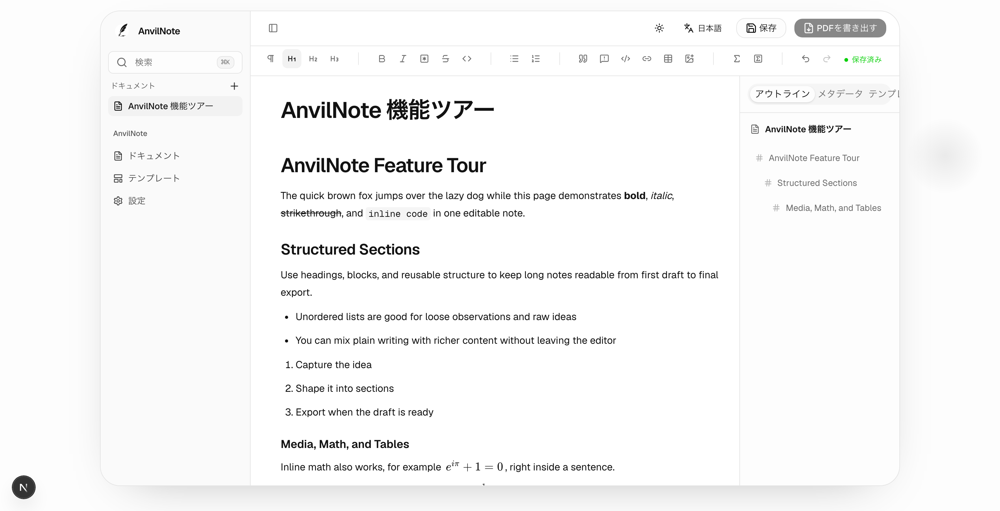

# AnvilNote

AnvilNote は、長文のノート、講義資料、レポート、学術文書向けに設計された、オフラインファーストの執筆・ノートアプリです。Notion に似た執筆体験を提供しつつ、構造化されたドキュメントのエクスポート、テンプレート、フォント、数式、コードブロック、PDF 生成により重点を置いています。

## AnvilNote の特長

- **デフォルトでオフラインファースト。** ノートはあなたのマシン上に保存されます。
- **ローカルデスクトップ利用にログイン不要。**
- **長文執筆のために設計。** 講義ノート、レポート、学術論文など、短いメモだけではありません。
- **数式・コードブロック・テンプレート・PDF エクスポート**は中核機能です。
- **Typst ベースのレンダリング**で高速かつ高品質な PDF 出力を実現。
- **デスクトップアプリは必要なツールをバンドル済み。** Node.js や Typst を別途インストールする必要はありません。

## はじめに

- [はじめに](getting-started.md) — アプリをインストールして最初のドキュメントを書く
- [機能](features.md) — AnvilNote が現在できること

## ダウンロード

デスクトップアプリは [anvilnote-desktop のリリースページ](https://github.com/AnvilNote/anvilnote-desktop/releases) から入手できます。

## プロジェクトの状況

AnvilNote は開発初期段階にあります。デスクトップアプリは公開プレビュー中で、他のリポジトリも公開に向けて準備が進められています。アーキテクチャとロードマップは[プロジェクト概要](https://github.com/AnvilNote/anvilnote)を参照してください。
