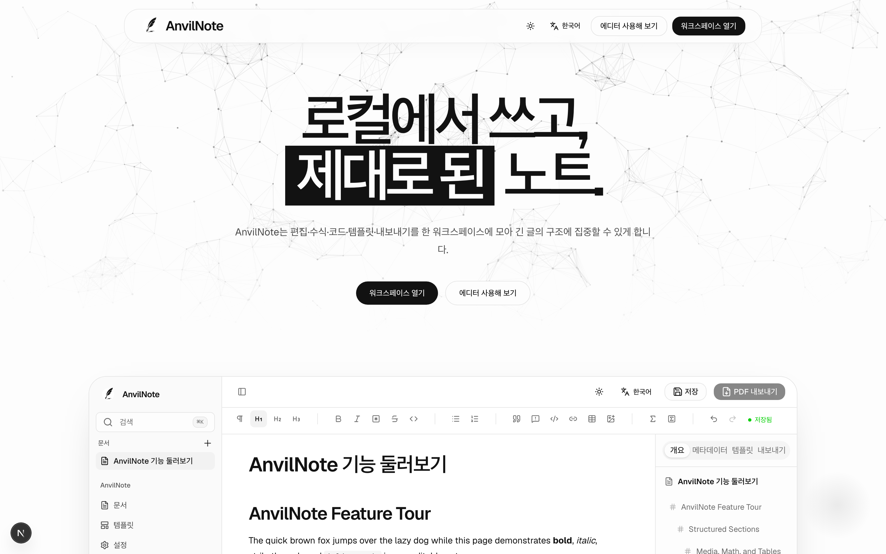

# AnvilNote

AnvilNote는 장문의 노트, 강의 자료, 보고서, 학술 문서를 위한 오프라인 우선 작성 및 노트 앱입니다. Notion과 유사한 작성 경험을 제공하면서도, 구조화된 문서 내보내기, 템플릿, 폰트, 수식, 코드 블록, PDF 생성에 더 중점을 둡니다.

## AnvilNote를 선택하는 이유

- **기본적으로 오프라인 우선.** 노트는 사용자의 기기에 저장됩니다.
- **로컬 데스크톱 사용 시 로그인 불필요.**
- **장문 작성을 위해 설계.** 짧은 메모뿐 아니라 강의 노트, 보고서, 학술 논문에도 적합합니다.
- **수식, 코드 블록, 템플릿, PDF 내보내기**는 핵심 기능입니다.
- **Typst 기반 렌더링**으로 빠르고 고품질의 PDF 출력을 제공합니다.
- **데스크톱 앱에는 필요한 도구가 번들로 포함.** Node.js나 Typst를 별도로 설치할 필요가 없습니다.

## 시작하기

- [시작하기](getting-started.md) — 앱을 설치하고 첫 문서를 작성해 보세요
- [기능](features.md) — AnvilNote가 현재 제공하는 기능

## 다운로드

데스크톱 앱은 [anvilnote-desktop 릴리스 페이지](https://github.com/AnvilNote/anvilnote-desktop/releases)에서 받을 수 있습니다.

## 프로젝트 상태

AnvilNote는 초기 개발 단계에 있습니다. 데스크톱 앱은 공개 프리뷰 상태이며, 다른 저장소들도 공개를 위해 준비 중입니다. 아키텍처와 로드맵은 [프로젝트 개요](https://github.com/AnvilNote/anvilnote)를 참고하세요.
