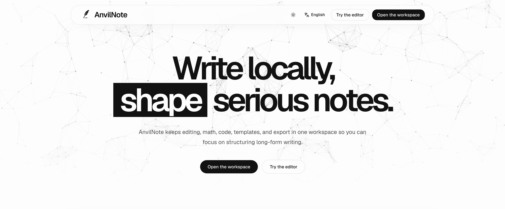
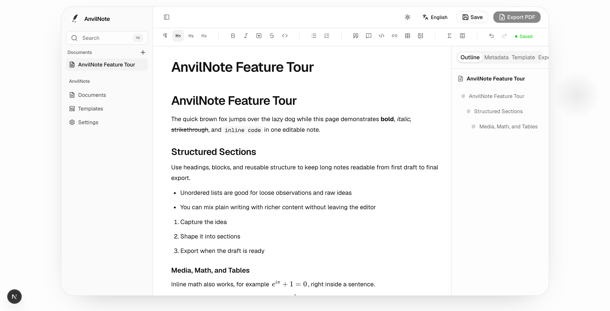

# AnvilNote

AnvilNote is an offline-first writing and note-taking app for long-form notes, lecture handouts, reports, and academic documents. It provides a Notion-like writing experience, but focuses more on structured document export, templates, fonts, formulas, code blocks, and PDF generation.

## Why AnvilNote

- **Offline-first by default.** Your notes live on your machine.
- **No login required for local desktop use.**
- **Built for long-form writing** — lecture notes, reports, academic papers — not just short notes.
- **Formulas, code blocks, templates, and PDF export** are core features.
- **Typst-based rendering** for fast, high-quality PDF output.
- **The desktop app bundles required tooling.** No separate Node.js or Typst install needed.

## Get started

- [Getting Started](getting-started.md) — install the app and write your first document
- [Features](features.md) — what AnvilNote can do today

## Download

The desktop app is available from the [anvilnote-desktop releases page](https://github.com/AnvilNote/anvilnote-desktop/releases).

## Project status

AnvilNote is in early development. The desktop app is in public preview; other repositories are being prepared for public release. See the [project overview](https://github.com/AnvilNote/anvilnote) for architecture and roadmap.
