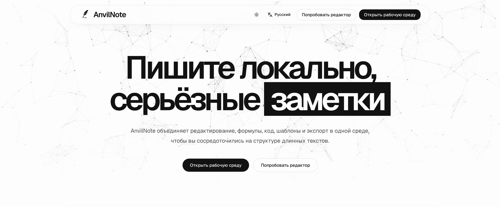
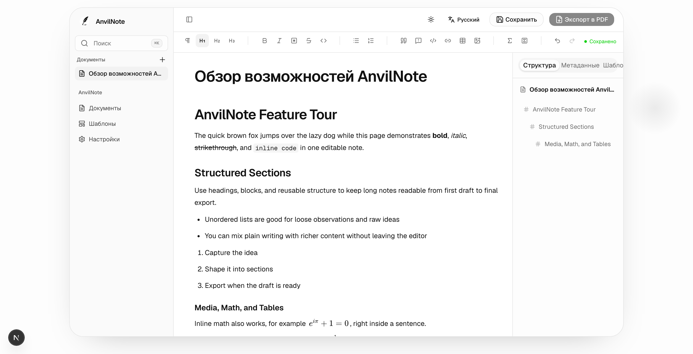

# AnvilNote

AnvilNote — это офлайн-ориентированное приложение для письма и заметок, предназначенное для развёрнутых заметок, конспектов лекций, отчётов и академических документов. Оно предлагает опыт письма, похожий на Notion, но с большим упором на структурированный экспорт документов, шаблоны, шрифты, формулы, блоки кода и генерацию PDF.

## Почему AnvilNote

- **Офлайн-режим по умолчанию.** Заметки хранятся на вашем устройстве.
- **Не требует входа в систему для локального использования на десктопе.**
- **Создано для развёрнутого письма** — конспектов лекций, отчётов, академических работ, а не только коротких заметок.
- **Формулы, блоки кода, шаблоны и экспорт в PDF** — базовые возможности.
- **Рендеринг на основе Typst** обеспечивает быстрый и качественный вывод PDF.
- **Десктопное приложение включает все необходимые инструменты.** Node.js и Typst устанавливать отдельно не нужно.

## Начало работы

- [Начало работы](getting-started.md) — установите приложение и напишите первый документ
- [Возможности](features.md) — что AnvilNote умеет уже сейчас

## Загрузка

Десктопное приложение доступно на [странице релизов anvilnote-desktop](https://github.com/AnvilNote/anvilnote-desktop/releases).

## Статус проекта

AnvilNote находится на ранней стадии разработки. Десктопное приложение — в публичном превью, остальные репозитории готовятся к публикации. Архитектуру и дорожную карту см. в [обзоре проекта](https://github.com/AnvilNote/anvilnote).
