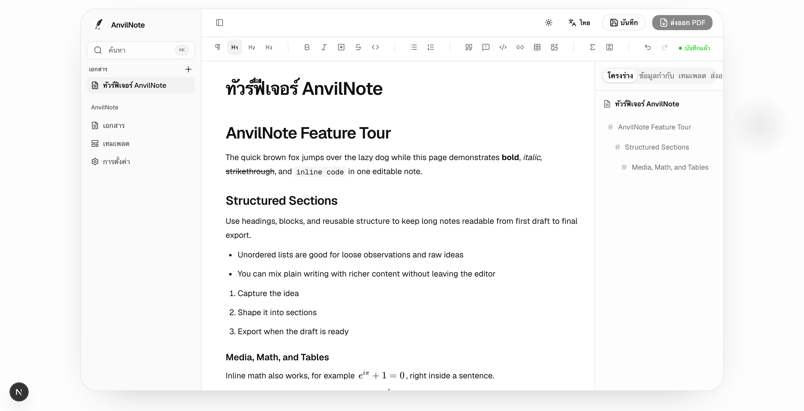

# AnvilNote

AnvilNote คือแอปเขียนบันทึกแบบออฟไลน์เป็นหลัก ออกแบบมาสำหรับบันทึกยาว เอกสารประกอบการบรรยาย รายงาน และเอกสารทางวิชาการ ให้ประสบการณ์การเขียนคล้าย Notion แต่เน้นการส่งออกเอกสารแบบมีโครงสร้าง เทมเพลต ฟอนต์ สูตรคณิตศาสตร์ บล็อกโค้ด และการสร้างไฟล์ PDF มากกว่า

## ทำไมต้อง AnvilNote

- **ออฟไลน์เป็นค่าเริ่มต้น** ข้อมูลบันทึกอยู่บนเครื่องของคุณเอง
- **ไม่ต้องเข้าสู่ระบบสำหรับการใช้งานเดสก์ท็อปแบบโลคัล**
- **ออกแบบมาเพื่อการเขียนบทความยาว** ทั้งบันทึกการบรรยาย รายงาน และงานวิชาการ ไม่ใช่แค่บันทึกสั้น ๆ
- **สูตรคณิตศาสตร์ บล็อกโค้ด เทมเพลต และการส่งออก PDF** เป็นฟีเจอร์หลัก
- **เรนเดอร์ด้วย Typst** ให้ผลลัพธ์ PDF ที่รวดเร็วและคุณภาพสูง
- **แอปเดสก์ท็อปมาพร้อมเครื่องมือที่จำเป็นในตัว** ไม่ต้องติดตั้ง Node.js หรือ Typst แยกต่างหาก

## เริ่มต้นใช้งาน

- [เริ่มต้นใช้งาน](getting-started.md) — ติดตั้งแอปและเขียนเอกสารแรกของคุณ
- [ฟีเจอร์](features.md) — สิ่งที่ AnvilNote ทำได้ในตอนนี้

## ดาวน์โหลด

แอปเดสก์ท็อปดาวน์โหลดได้ที่ [หน้ารีลีสของ anvilnote-desktop](https://github.com/AnvilNote/anvilnote-desktop/releases)

## สถานะโปรเจกต์

AnvilNote อยู่ในช่วงพัฒนาระยะแรก แอปเดสก์ท็อปอยู่ในช่วงพรีวิวสาธารณะ ส่วนรีพอสิทอรีอื่น ๆ กำลังเตรียมเปิดเผยต่อสาธารณะ ดูสถาปัตยกรรมและแผนงานได้ที่ [ภาพรวมโปรเจกต์](https://github.com/AnvilNote/anvilnote)
